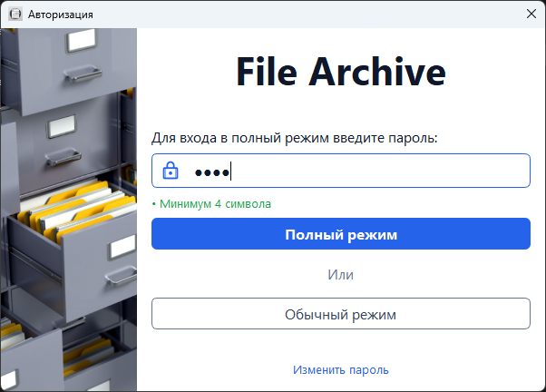
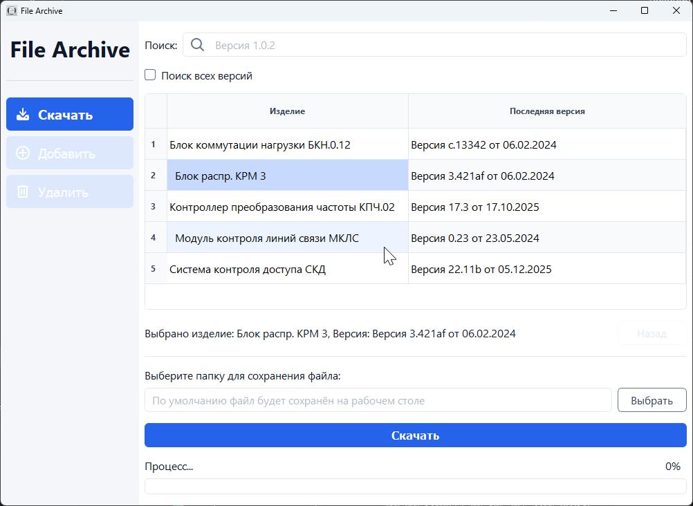
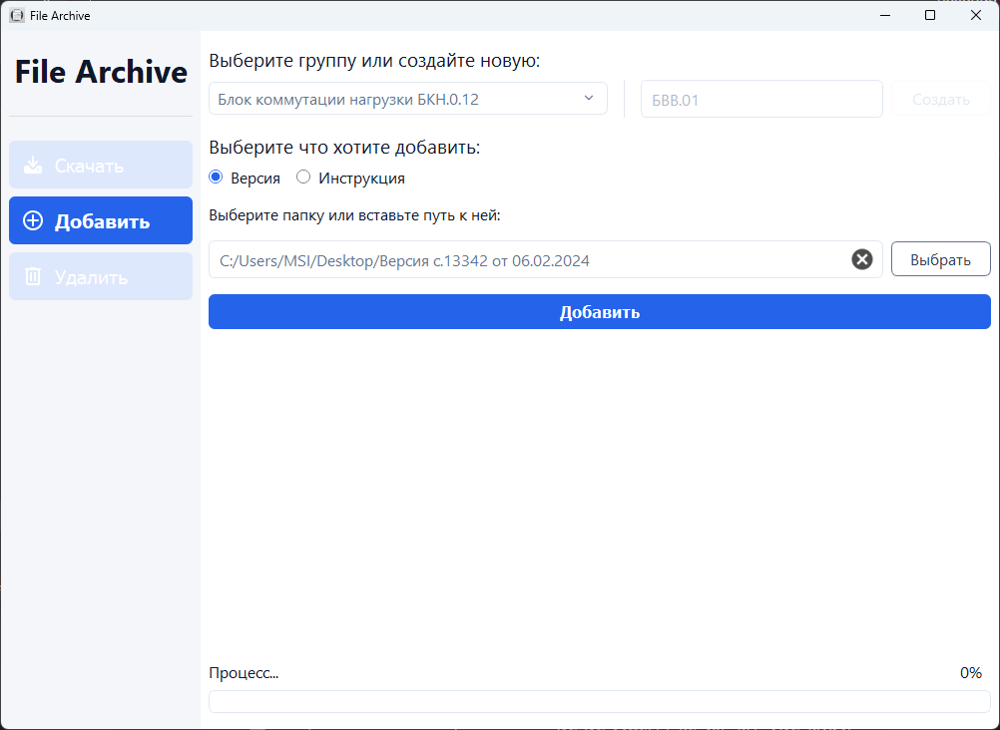
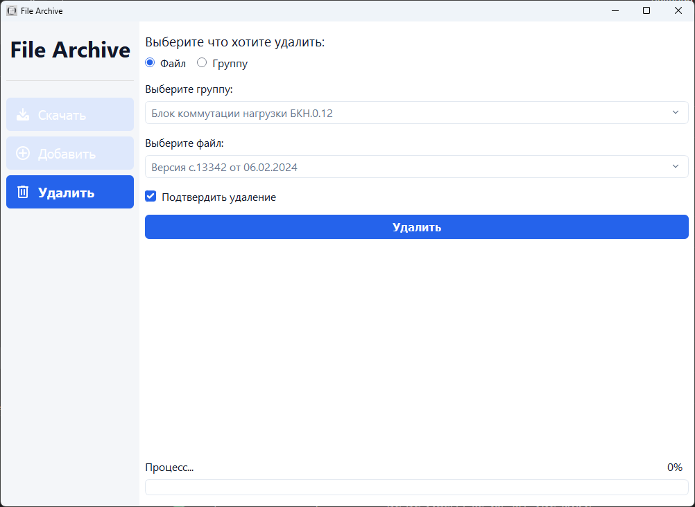

# File Archive — Русская версия

> **English version:** см. README.md 


## 🖼 Скриншоты

### Окно авторизации  
Безопасный вход с проверкой пароля.  
Позволяет выбрать Полный или Обычный режим работы,  
а также перейти к изменению пароля.



### Вкладка «Скачать»  
Отображает все изделия и последние доступные версии.  
Пользователь может искать, выбирать изделие и версию,  
и скачивать файлы (по умолчанию на рабочий стол или в выбранную папку).



### Вкладка «Добавить»  
Доступна в Полном режиме.  
Позволяет добавлять новые версии или прикреплять DOCX-инструкции  
к существующим или новым группам изделий.



### Вкладка «Удалить»  
Доступна в Полном режиме.  
Позволяет удалять отдельные версии или целые группы изделий,  
с защитой от случайного удаления.



---

## 📥 Процесс скачивания

1. Выберите изделие одним щелчком в таблице  
   (автоматически выбирается последняя доступная версия)

2. Дополнительно: дважды нажмите на изделие, чтобы открыть список версий  
   и выбрать **любую предыдущую версию**, если она ранее была загружена

3. Выберите путь сохранения:  
   - по умолчанию файл скачивается на рабочий стол  
   - при необходимости можно указать другую папку

4. Нажмите **Скачать**  
   Выбранная версия будет расшифрована и сохранена по указанному пути

---

## 📌 Обзор

**File Archive** обеспечивает безопасное, структурированное хранение, обновление, распространение и скачивание версионных файлов и технической документации.  

Приложение использует пользовательские криптографические ключи, а также поддерживает разные режимы доступа для инженеров и производственного персонала.  

Подходит для систем, где важны безопасность, контроль доступа, целостность и актуальность версий.

---

## 🎯 Основной функционал

### ✅ Версионное хранение файлов
- группировка по изделиям
- версии внутри каждой группы
- автоматическое определение последней версии
- файлы хранятся зашифрованными

### ✅ Два режима работы
#### 🔐 Полный режим (после ввода пароля)
- добавление новых версий
- добавление `.docx` файлов инструкций
- удаление версий или групп
- управление структурой
- для инженеров и технологов

#### ✅ Обычный режим
- вкладки Добавить/Удалить видны, но отключены
- можно только скачивать
- для рабочих/операторов

### ✅ Поддержка DOCX инструкций
Можно прикреплять инструкцию к каждому изделию.

### ✅ Особенности UI/UX
- интерфейс PyQt5
- навигация по уровням
- поиск среди версий
- индикаторы выполнения
- всплывающие уведомления

---

## 🧩 Кому подходит это приложение

✅ Инженерным отделам  
✅ Производству и цехам  
✅ Компаниям с контролируемой документацией  
✅ Организациям, где важны версии файлов  
✅ Предприятиям с разделением доступа (инженеры / рабочие)

---

## 🧠 Что этот проект демонстрирует обо мне

✅ Python ООП  
✅ Разработку десктоп-приложений  
✅ PyQt GUI и сигнально-слотовую модель  
✅ Архитектуру MVC  
✅ Многопоточность для длительных операций  
✅ Безопасную работу с файлами  
✅ Продуманный UX и управление состоянием  
✅ Структурирование и документирование  
✅ Инженерное мышление и практическую применимость  

---

## 🏗 Архитектура
```
┌──────┐     ┌────────────┐     ┌───────┐
│ View │ <-- │ Controller │ --> │ Model │
└──────┘     └────────────┘     └───────┘
```

---

## 🛠 Стек технологий

- Python **3.10**
- PyQt5
- cryptography (Fernet)
- PyYAML
- threading
- pathlib

---

## 🔧 Установка

```bash
git clone https://github.com/pntech-dev/File-Archive.git
cd File-Archive
pip install -r requirements.txt
```

---

## 🔑 Генерация ключей и инициализация

1. Запустите скрипт генерации ключей: `python generate_keyfiles.py`
2. `config.yaml` создаётся на основе `config_template.yaml`
3. Ключи сохраняются локально и не коммитятся
4. После этого приложение готово к работе

---

## 🏗 Сборка (опционально)

```bash
pyinstaller "File Archive.spec"
```

---

## 📂 Структура проекта

(структура аналогична английской версии)

---

## 🔒 Модель безопасности

✅ Шифрование Fernet  
✅ Отсутствие хранения паролей в открытом виде  
✅ Ключи не включены в репозиторий  
✅ Инициализация под конкретного пользователя  
✅ Безопасно для внутреннего использования  

---

## 🚦 Статус проекта

✅ Завершён  
✅ Поддерживается при необходимости  
❌ Активная разработка не ведётся  

---

## 📜 Лицензия

MIT License

Copyright (c) 2025 Pavel (PN Tech)

---

## 👤 Автор

**Pavel (PN Tech)**  
Python desktop и web разработчик, UI/UX дизайнер, инженер-электроник
